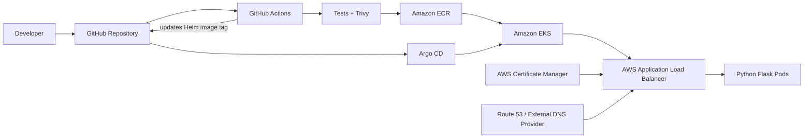

# Architecture

## Main flow

1. Developer pushes to GitHub.
2. GitHub Actions runs Python tests and filesystem security scanning.
3. Docker image is built.
4. Trivy scans the image for HIGH/CRITICAL vulnerabilities.
5. Image is pushed to Amazon ECR using the Git commit SHA as an immutable tag.
6. Workflow updates the Helm image tag in Git.
7. Argo CD detects the Git change and syncs EKS.
8. AWS Load Balancer Controller creates an internet-facing ALB from the Ingress.
9. ACM provides the certificate for HTTPS.
10. ALB forwards traffic to the Kubernetes service and Python pods.

## Components

- GitHub: source + desired state
- GitHub Actions: CI and image publishing
- ECR: container registry
- EKS: Kubernetes runtime
- Argo CD: GitOps continuous delivery
- AWS Load Balancer Controller: ALB provisioning
- ACM: TLS certificate
- Route 53 or another DNS provider: DNS
